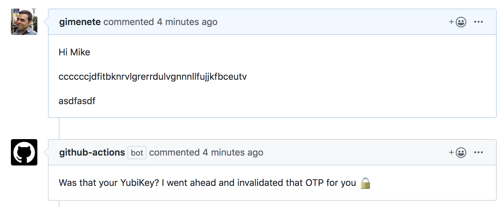

# yubikey-invalidation-action

GitHub Action that invalidates Yubikeys found in issues or issue comments or any text you pass to it. At this moment it only invalidates the first one it founds.



Example workflow:

```yaml
name: YubiKey
on: [issues, issue_comment]

jobs:
  invalidate:
    runs-on: ubuntu-latest
    name: Invalidate YubiKeys
    steps:
    - name: Find and invalidate
      id: invalidate
      uses: gimenete/yubikey-invalidation-action@master
      with:
        YUBIKEY_API_ID: 11111
        text: ${{ github.event.comment.body || github.event.issue.body }}
        GITHUB_TOKEN: ${{ secrets.GITHUB_TOKEN }}
        payload: ${{ toJSON(github.event) }}
```

You can get an API ID from Yubico here https://upgrade.yubico.com/getapikey/

The `GITHUB_TOKEN` and the `payload` are only required if you want it to automatically leave an issue comment.

The action also outputs:

- `message`: A summary of what the action did
- `found`: Whether or not a YubiKey was found
- `invalidated`: Whether or not a YubiKey was successfully invalidated
